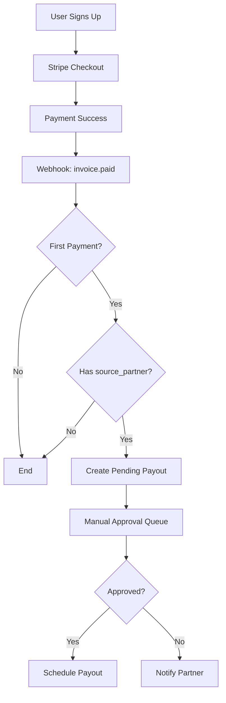

# Job Board Partnership Strategy - OnlyWorks

## Executive Summary

**Business Model:** Partner with job boards to acquire rejected/ghosted candidates who need to verify their skills and experience.

**Revenue Model:** Job boards earn $10 per candidate who becomes a paying OnlyWorks subscriber.

**Key Insight:** Rejected candidates are wasted traffic for job boards. We turn that into revenue while helping candidates prove their value.

---

## Table of Contents

1. [**🚀 First Steps - Quick Start Guide**](#-first-steps---quick-start-guide) ⭐ **READ THIS FIRST**
2. [Business Model & Unit Economics](#business-model--unit-economics)
3. [Implementation Phases](#implementation-phases)
4. [**Phase 0 - Detailed Implementation Guide**](#phase-0---detailed-implementation-guide) ⭐ **BUILD THIS FIRST**
5. [Technical Architecture](#technical-architecture)
6. [Partner Management](#partner-management)
7. [Candidate Experience](#candidate-experience)
8. [Go/No-Go Criteria](#gono-go-criteria)

---

## 🚀 First Steps - Quick Start Guide

**Goal:** Get from zero to first job board partner as fast as possible.

---

### What You Actually Need to Launch

**The Bare Minimum (2-3 Weeks):**

✅ Partner link generation system
✅ Landing page that captures attribution
✅ Signup flow that saves source_partner
✅ Stripe webhook that creates payout records
✅ Admin page to manually approve payouts
✅ Email templates for partners

**What You DON'T Need Yet:**
❌ Partner dashboard (they can email you)
❌ Automated payouts (manual Venmo/PayPal first)
❌ Analytics dashboards (use database queries)
❌ Click tracking (Stripe conversions only)
❌ Marketing materials library (Google Drive folder is fine)

---

### The Real Chronological Order

#### **Week 1: Build the Infrastructure**

**Day 1-2: Database Setup**
1. Add `partners` table to database
2. Add `source_partner`, `first_opt_in`, `future_opt_in` fields to `users` table
3. Add `partner_payouts` table
4. Run all migrations
5. Test with sample data

**Day 3-4: Backend APIs**
1. Create `/api/partners/create` endpoint
   - Input: partner name, email
   - Output: unique tracking link
2. Update signup API to save `source_partner`
3. Update Stripe webhook to create payout records on first payment

**Day 5: Landing Page**
1. Create `/verify-skills` page
2. Capture `?src=` parameter from URL
3. Store in sessionStorage + 30-day cookie
4. Pass to signup flow

✅ **Completion Check:** You can create a partner link → click it → sign up → see source_partner in database

---

#### **Week 2: Approval System + Partner Kit**

**Day 1-2: Manual Approval System**
1. Create admin page at `/admin/payouts`
2. Show pending payouts with:
   - Partner name
   - User email
   - Amount ($10)
   - Subscription date
3. Add "Approve" and "Deny" buttons
4. Test: approve a payout → status changes to "approved"

**Day 3-4: Partner Marketing Kit**
1. Write email template for rejected candidates
2. Create 3 placement examples:
   - Rejection page copy
   - Rejection email copy
   - Dashboard card copy
3. Make simple visual mockups (Figma or screenshot)
4. Put everything in a Google Drive folder

**Day 5: Partner Onboarding Email**
1. Write template for sending partners their link
2. Include:
   - Their unique link
   - Placement rules
   - Payout terms
   - Marketing materials folder
3. Test: send yourself the email, verify all links work

✅ **Completion Check:** You can onboard a partner and give them everything they need in one email

---

#### **Week 3: Get Your First Partner**

**Day 1-2: Partner Research**
1. Find 10 small job boards in your niche
2. Prioritize:
   - Tiny niche boards (design, marketing, dev)
   - Community-run (Reddit, Discord, Slack groups)
   - Bootstrapped (need revenue)
3. Find contact emails

**Day 3: Cold Outreach**
1. Send personalized emails to 10 boards
2. Subject: "Turn rejected candidates into revenue"
3. Body: Quick value prop + calendly link
4. Follow up after 3 days

**Day 4-5: Onboarding Calls**
1. Schedule calls with interested partners
2. Show them the link and materials
3. Walk through placement examples
4. Answer questions
5. Send partner package email immediately after call

✅ **Completion Check:** 1-3 job boards agree to partner and receive their links

---

#### **Week 4: Go Live + Monitor**

**Day 1: Partner Implementation**
1. Partners add your link to rejection pages/emails
2. They email you when live
3. You visit their site and verify placement

**Day 2-3: Track Conversions**
1. Watch database for new signups with `source_partner`
2. Monitor Stripe for payments
3. Check `partner_payouts` table for pending records

**Day 4-5: Manual Payouts**
1. Review pending payouts in admin dashboard
2. Verify placement is correct (check job board site)
3. Verify messaging is intact (matches your templates)
4. If both ✅ → approve payout
5. Manually send $10 via PayPal/Venmo
6. Mark payout as "paid" in database
7. Email partner: "Your payout has been sent!"

✅ **Completion Check:** First partner gets their $10 payout

---

### What Happens With Your First Partner

**Real Example Timeline:**

**Day 0:** You email "TinyDesignJobs.io"
**Day 2:** They respond interested
**Day 3:** Onboarding call (10 minutes)
**Day 3:** Send them partner package with unique link
**Day 5:** They add link to rejection email template
**Day 5:** They email you: "We're live!"
**Day 6:** You verify: visit their site, check email template
**Day 10:** First candidate clicks their link
**Day 10:** Candidate signs up (source_partner = "tinydesignjobs_io")
**Day 17:** Candidate subscribes to $35/month plan
**Day 17:** Stripe webhook creates pending payout
**Day 20:** You check: placement ✅, messaging ✅, payment cleared ✅
**Day 20:** You approve payout in admin dashboard
**Day 20:** You PayPal them $10
**Day 20:** You mark as "paid" in database
**Day 20:** You email them: "Your first payout ($10) has been sent!"
**Day 21:** They refer 3 more job boards to you

---

### Quick Decision Tree

**"Should I build partner dashboards first?"**
→ No. They can email you. Focus on link generation.

**"Should I automate payouts with Stripe Connect?"**
→ No. Manual Venmo/PayPal for first 10 partners. Automate at 20+ partners.

**"Should I build analytics tracking?"**
→ No. Just track source_partner → payment conversion. That's all you need to approve payouts.

**"Should I create fancy marketing materials?"**
→ No. Google Drive folder with email templates and mockups is fine.

**"Should I partner with big job boards first?"**
→ No. Start with tiny niche boards. They respond faster and need revenue.

**"Do I need legal contracts?"**
→ Not yet. Simple terms in the onboarding email is fine for first 5 partners. Get lawyer at 20+ partners.

---

### The 80/20 Rule

**20% of Work (Do First):**
1. Partner link generation (database + API)
2. Attribution capture (landing page + signup)
3. Payout creation (Stripe webhook)
4. Manual approval (simple admin page)
5. Partner email templates (Google Doc)

**80% of Work (Do Later):**
- Partner dashboards
- Automated payouts
- Analytics dashboards
- Compliance automation
- Legal contracts
- Fraud detection
- Multi-currency support
- White-label options

---

### Red Flags to Watch For

⚠️ **Week 1:**
- Database migrations failing → fix immediately
- Attribution not saving → test with multiple browsers
- Stripe webhook not firing → check webhook secret

⚠️ **Week 2:**
- Can't create clean partner links → fix URL generation logic
- Partner materials unclear → ask a friend to review
- Onboarding email confusing → A/B test with 2 versions

⚠️ **Week 3:**
- No responses from job boards → improve outreach email
- Partners don't understand value → simplify pitch
- Partners want guarantees you can't make → adjust expectations

⚠️ **Week 4:**
- No signups from partner links → check if links are live
- Signups but no conversions → improve landing page
- Partners placing links wrong → create clearer placement guide

---

### Your First Month Success Metrics

**Minimum Viable Launch:**
- 1-3 job board partners live
- 10+ clicks from partner links
- 2+ signups attributed to partners
- 1 paid conversion
- 1 payout sent manually

**Good Launch:**
- 3-5 partners live
- 50+ clicks
- 5+ signups
- 2-3 paid conversions
- 2-3 payouts sent

**Great Launch:**
- 5-10 partners live
- 100+ clicks
- 10+ signups
- 5+ paid conversions
- 5+ payouts sent

---

### Next: Go Build Phase 0

Once you understand this roadmap, jump to **[Phase 0 - Detailed Implementation Guide](#phase-0---detailed-implementation-guide)** below for step-by-step code and setup instructions.

---

## Business Model & Unit Economics

### The Opportunity

**Problem for Job Boards:**
- Get flooded with applicants
- Only monetize employers
- Make $0 from rejected candidates
- Pay infrastructure costs for rejected traffic

**Problem for Candidates:**
- Get rejected or ghosted
- Skills and experience remain invisible
- No way to prove their value
- Stuck in same position

**OnlyWorks Solution:**
- Turn rejected traffic into revenue for job boards
- Help candidates verify their real skills and experience
- Create proof employers can't ignore
- Position as rejection recovery, not another job search tool

### Unit Economics

**Payout Structure:**
- $10 flat bounty per paid subscriber
- Paid once (first subscription only)
- No recurring revenue share
- No signup bonuses

**Critical Assumptions:**
- LTV per user must be >$60 minimum
- If subscription is <$20/month → model breaks
- If conversion <5% → CAC explodes
- Need 30-day payment validation before payout

**Example Math:**
- Job board sends 200 rejected candidates/month
- 10% click the link → 20 users
- 10% convert to paid → 2 paid users
- Job board earns: $20/month
- OnlyWorks CAC: $10/user
- If LTV = $100 → profitable
- If LTV = $40 → losing money

**Breakeven Calculation:**
```
Required LTV = ($10 CAC × 6) = $60 minimum
Ideal LTV = $100+
```

---

## Implementation Phases

### PHASE 0: Partner Link Infrastructure (START HERE)

**Why This Comes First:**
You cannot partner with anyone without links to give them. This is the foundation.

#### 0.1 Build Link Generation System

**Database Schema:**
```sql
-- partners table
CREATE TABLE partners (
  id UUID PRIMARY KEY,
  name VARCHAR(255),
  contact_email VARCHAR(255),
  unique_code VARCHAR(50) UNIQUE,
  status VARCHAR(50), -- active, paused, pending
  created_at TIMESTAMP,
  approved_at TIMESTAMP
);

-- users table (add these fields)
ALTER TABLE users ADD COLUMN source_partner VARCHAR(50);
ALTER TABLE users ADD COLUMN first_opt_in BOOLEAN;
ALTER TABLE users ADD COLUMN future_opt_in BOOLEAN;
ALTER TABLE users ADD COLUMN attribution_date TIMESTAMP;
ALTER TABLE users ADD COLUMN attribution_locked BOOLEAN DEFAULT true;

-- payouts table
CREATE TABLE partner_payouts (
  id UUID PRIMARY KEY,
  partner_id UUID REFERENCES partners(id),
  user_id UUID REFERENCES users(id),
  amount DECIMAL(10,2),
  status VARCHAR(50), -- pending, approved, denied, paid
  subscription_date TIMESTAMP,
  approval_date TIMESTAMP,
  payout_date TIMESTAMP,
  notes TEXT
);
```

#### 0.2 Link Generation Logic

**URL Format:**
```
https://onlyworks.com/verify-skills?src=jobboard_xyz
```

**Partner Code Rules:**
- Lowercase only
- No spaces (use underscores)
- Max 50 characters
- Must be unique
- Cannot be changed once issued

**Generation Function (Pseudo-code):**
```javascript
function generatePartnerLink(partnerName) {
  // Sanitize partner name
  const code = partnerName
    .toLowerCase()
    .replace(/[^a-z0-9]/g, '_')
    .substring(0, 50);

  // Check uniqueness
  if (partnerExists(code)) {
    return code + '_' + randomSuffix();
  }

  // Store in database
  createPartner({
    name: partnerName,
    unique_code: code,
    status: 'pending'
  });

  return `https://onlyworks.com/verify-skills?src=${code}`;
}
```

#### 0.3 Attribution Tracking

**When User Clicks Link:**
```javascript
// On landing page load
const urlParams = new URLSearchParams(window.location.search);
const source = urlParams.get('src');

// Store in session
if (source) {
  sessionStorage.setItem('source_partner', source);
  // Optional: set 30-day cookie
  setCookie('ow_src', source, 30);
}
```

**When User Signs Up:**
```javascript
// On account creation
const sourcePartner = sessionStorage.getItem('source_partner')
  || getCookie('ow_src');

if (sourcePartner) {
  // Store attribution (LOCKED FOREVER)
  user.source_partner = sourcePartner;
  user.attribution_date = new Date();
  user.attribution_locked = true;
}
```

**Critical Rule:**
Once `source_partner` is set, it NEVER changes. First-touch attribution wins.

#### 0.4 Testing Checklist

- [ ] Generate 5 test partner links
- [ ] Click each link → verify `src` parameter is captured
- [ ] Sign up with test account → verify `source_partner` is stored
- [ ] Try signing up from different source → verify original attribution is locked
- [ ] Test cookie persistence (return 7 days later)

---

## Phase 0 - Detailed Implementation Guide

⭐ **THIS IS WHERE YOU START** ⭐

This section contains everything you need to build the partner link infrastructure from scratch. Follow this step-by-step to get Phase 0 fully working in 1-2 weeks.

---

### Overview: What Phase 0 Delivers

By the end of Phase 0, you will have:

✅ Partner link generation system
✅ Unique tracking URLs for each job board
✅ Automatic attribution capture on landing page
✅ Source partner stored in user records (locked forever)
✅ Stripe webhook listening for payments
✅ Automatic payout record creation
✅ Manual approval queue ready

**You will NOT have yet (comes later):**
- Automated approval system
- Partner dashboard
- Complex analytics
- Payout automation

That's intentional. Phase 0 is about **foundation**, not polish.

---

### Implementation Timeline

**Week 1:**
- Days 1-2: Database setup
- Days 3-4: Backend APIs
- Day 5: Testing

**Week 2:**
- Days 1-2: Landing page + attribution
- Days 3-4: Stripe webhook
- Day 5: End-to-end testing

---

### Step 1: Database Setup

#### 1.1 Create Migration Files

**File: `migrations/001_create_partners_table.sql`**

```sql
-- Partners table
CREATE TABLE partners (
  id UUID PRIMARY KEY DEFAULT gen_random_uuid(),
  name VARCHAR(255) NOT NULL,
  contact_email VARCHAR(255) NOT NULL,
  unique_code VARCHAR(50) UNIQUE NOT NULL,
  status VARCHAR(50) DEFAULT 'pending',
  created_at TIMESTAMP DEFAULT NOW(),
  approved_at TIMESTAMP,
  notes TEXT
);

-- Index for fast lookups
CREATE INDEX idx_partners_unique_code ON partners(unique_code);
CREATE INDEX idx_partners_status ON partners(status);

-- Insert test partner for development
INSERT INTO partners (name, contact_email, unique_code, status)
VALUES ('TestBoard', 'test@example.com', 'testboard', 'active');
```

**File: `migrations/002_add_user_attribution_fields.sql`**

```sql
-- Add attribution fields to users table
ALTER TABLE users
  ADD COLUMN source_partner VARCHAR(50),
  ADD COLUMN first_opt_in BOOLEAN DEFAULT false,
  ADD COLUMN future_opt_in BOOLEAN DEFAULT false,
  ADD COLUMN attribution_date TIMESTAMP,
  ADD COLUMN attribution_locked BOOLEAN DEFAULT true;

-- Index for fast partner attribution queries
CREATE INDEX idx_users_source_partner ON users(source_partner);

-- Foreign key constraint (optional, for data integrity)
ALTER TABLE users
  ADD CONSTRAINT fk_source_partner
  FOREIGN KEY (source_partner)
  REFERENCES partners(unique_code)
  ON DELETE SET NULL;
```

**File: `migrations/003_create_payouts_table.sql`**

```sql
-- Partner payouts table
CREATE TABLE partner_payouts (
  id UUID PRIMARY KEY DEFAULT gen_random_uuid(),
  partner_id VARCHAR(50) NOT NULL,
  user_id BIGINT NOT NULL,
  amount DECIMAL(10,2) DEFAULT 10.00,
  status VARCHAR(50) DEFAULT 'pending',
  subscription_date TIMESTAMP,
  approval_date TIMESTAMP,
  payout_date TIMESTAMP,
  denial_reason TEXT,
  notes TEXT,
  created_at TIMESTAMP DEFAULT NOW(),

  -- Foreign keys
  CONSTRAINT fk_payout_partner FOREIGN KEY (partner_id) REFERENCES partners(unique_code),
  CONSTRAINT fk_payout_user FOREIGN KEY (user_id) REFERENCES users(id)
);

-- Indexes for fast queries
CREATE INDEX idx_payouts_status ON partner_payouts(status);
CREATE INDEX idx_payouts_partner_id ON partner_payouts(partner_id);
CREATE INDEX idx_payouts_user_id ON partner_payouts(user_id);

-- Prevent duplicate payouts for same user
CREATE UNIQUE INDEX idx_payouts_unique_user ON partner_payouts(user_id);
```

#### 1.2 Run Migrations

```bash
# If using Supabase or PostgreSQL
psql -d onlyworks -f migrations/001_create_partners_table.sql
psql -d onlyworks -f migrations/002_add_user_attribution_fields.sql
psql -d onlyworks -f migrations/003_create_payouts_table.sql

# Verify tables exist
psql -d onlyworks -c "\dt"
```

#### 1.3 Test Data Insertion

```sql
-- Verify test partner was created
SELECT * FROM partners WHERE unique_code = 'testboard';

-- Should return:
-- id | name | contact_email | unique_code | status | created_at
-- ... | TestBoard | test@example.com | testboard | active | 2026-01-15...
```

✅ **Completion Checklist:**
- [ ] All 3 migration files created
- [ ] Migrations run successfully
- [ ] Test partner exists in database
- [ ] All indexes created
- [ ] Foreign keys working

---

### Step 2: Backend API - Partner Link Generation

#### 2.1 Create Partner API Endpoint

**File: `app/api/partners/create/route.ts` (Next.js) or equivalent**

```typescript
import { NextRequest, NextResponse } from 'next/server';
import { createClient } from '@supabase/supabase-js';

const supabase = createClient(
  process.env.NEXT_PUBLIC_SUPABASE_URL!,
  process.env.SUPABASE_SERVICE_ROLE_KEY!
);

export async function POST(req: NextRequest) {
  try {
    const { name, contact_email } = await req.json();

    // Validate input
    if (!name || !contact_email) {
      return NextResponse.json(
        { error: 'Name and contact_email are required' },
        { status: 400 }
      );
    }

    // Generate unique code from name
    let uniqueCode = name
      .toLowerCase()
      .replace(/[^a-z0-9]/g, '_')
      .substring(0, 50);

    // Check if code exists, add suffix if needed
    let suffix = 1;
    let finalCode = uniqueCode;

    while (true) {
      const { data: existing } = await supabase
        .from('partners')
        .select('id')
        .eq('unique_code', finalCode)
        .single();

      if (!existing) break; // Code is unique

      finalCode = `${uniqueCode}_${suffix}`;
      suffix++;
    }

    // Create partner
    const { data: partner, error } = await supabase
      .from('partners')
      .insert({
        name,
        contact_email,
        unique_code: finalCode,
        status: 'pending'
      })
      .select()
      .single();

    if (error) {
      console.error('Partner creation error:', error);
      return NextResponse.json(
        { error: 'Failed to create partner' },
        { status: 500 }
      );
    }

    // Generate full URL
    const baseUrl = process.env.NEXT_PUBLIC_BASE_URL || 'https://onlyworks.com';
    const partnerLink = `${baseUrl}/verify-skills?src=${finalCode}`;

    return NextResponse.json({
      success: true,
      partner: {
        id: partner.id,
        name: partner.name,
        unique_code: partner.unique_code,
        link: partnerLink,
        status: partner.status
      }
    });

  } catch (error) {
    console.error('Unexpected error:', error);
    return NextResponse.json(
      { error: 'Internal server error' },
      { status: 500 }
    );
  }
}
```

#### 2.2 Test Partner Creation

```bash
# Test via curl
curl -X POST http://localhost:3000/api/partners/create \
  -H "Content-Type: application/json" \
  -d '{
    "name": "DesignJobs.io",
    "contact_email": "hello@designjobs.io"
  }'

# Expected response:
{
  "success": true,
  "partner": {
    "id": "uuid-here",
    "name": "DesignJobs.io",
    "unique_code": "designjobs_io",
    "link": "https://onlyworks.com/verify-skills?src=designjobs_io",
    "status": "pending"
  }
}
```

#### 2.3 Create Admin Tool (Optional CLI)

**File: `scripts/create-partner.js`**

```javascript
// Simple CLI tool for creating partners
const readline = require('readline');

const rl = readline.createInterface({
  input: process.stdin,
  output: process.stdout
});

async function createPartner() {
  const name = await question('Partner name: ');
  const email = await question('Contact email: ');

  const response = await fetch('http://localhost:3000/api/partners/create', {
    method: 'POST',
    headers: { 'Content-Type': 'application/json' },
    body: JSON.stringify({ name, contact_email: email })
  });

  const result = await response.json();

  if (result.success) {
    console.log('\n✅ Partner created successfully!');
    console.log(`🔗 Link: ${result.partner.link}`);
    console.log(`📋 Unique Code: ${result.partner.unique_code}\n`);
  } else {
    console.error('❌ Error:', result.error);
  }

  rl.close();
}

function question(prompt) {
  return new Promise(resolve => rl.question(prompt, resolve));
}

createPartner();
```

```bash
# Run it
node scripts/create-partner.js
```

✅ **Completion Checklist:**
- [ ] API endpoint created
- [ ] Uniqueness checking works
- [ ] Test partner created via API
- [ ] Links generated correctly
- [ ] Optional: CLI tool works

---

### Step 3: Landing Page - Attribution Capture

#### 3.1 Create `/verify-skills` Page

**File: `app/verify-skills/page.tsx`**

```typescript
'use client';

import { useEffect, useState } from 'react';
import { useSearchParams } from 'next/navigation';

export default function VerifySkillsPage() {
  const searchParams = useSearchParams();
  const [futureOptIn, setFutureOptIn] = useState(false);

  useEffect(() => {
    // Capture source parameter
    const source = searchParams.get('src');

    if (source) {
      // Store in sessionStorage
      sessionStorage.setItem('source_partner', source);

      // Set 30-day cookie
      document.cookie = `ow_src=${source}; max-age=${60*60*24*30}; path=/`;

      // Optional: Track event
      console.log(`Attribution captured: ${source}`);

      // Optional: Analytics event
      if (typeof window !== 'undefined' && (window as any).analytics) {
        (window as any).analytics.track('Partner Attribution Captured', {
          source_partner: source,
          page: 'verify-skills'
        });
      }
    }
  }, [searchParams]);

  const handleVerifyClick = () => {
    // Redirect to signup with first_opt_in flag
    sessionStorage.setItem('first_opt_in', 'true');
    window.location.href = '/auth/register';
  };

  const handleFutureOptInChange = (checked: boolean) => {
    setFutureOptIn(checked);
    sessionStorage.setItem('future_opt_in', checked.toString());
  };

  return (
    <div className="min-h-screen flex flex-col items-center justify-center px-4">
      {/* Top Section - Immediate Verify */}
      <section className="max-w-2xl text-center mb-16">
        <h1 className="text-4xl md:text-5xl font-bold mb-6">
          This role wasn't a fit, but your experience still counts
        </h1>
        <p className="text-lg text-gray-600 mb-8">
          Verify your projects, skills, and decisions so employers can see
          what you've actually done. Build credible proof that stands out.
        </p>
        <button
          onClick={handleVerifyClick}
          className="px-8 py-4 bg-primary text-white rounded-lg text-lg font-medium hover:bg-primary-dark transition"
        >
          Verify My Experience
        </button>
      </section>

      {/* Bottom Section - Future Build & Verify */}
      <section className="max-w-xl text-center bg-gray-50 rounded-lg p-8">
        <h3 className="text-xl font-semibold mb-4">
          Want us to help if you get ghosted again?
        </h3>
        <label className="flex items-start gap-3 cursor-pointer">
          <input
            type="checkbox"
            checked={futureOptIn}
            onChange={(e) => handleFutureOptInChange(e.target.checked)}
            className="mt-1"
          />
          <span className="text-left text-gray-700">
            Notify me and help me build + verify skills if I'm ghosted in the future
          </span>
        </label>
        <p className="text-sm text-gray-500 mt-4">
          Optional. We'll only reach out if you opt in. You control everything.
        </p>
      </section>
    </div>
  );
}
```

#### 3.2 Cookie Helper Functions

**File: `lib/cookies.ts`**

```typescript
export function getCookie(name: string): string | null {
  if (typeof document === 'undefined') return null;

  const value = `; ${document.cookie}`;
  const parts = value.split(`; ${name}=`);

  if (parts.length === 2) {
    return parts.pop()?.split(';').shift() || null;
  }

  return null;
}

export function setCookie(name: string, value: string, days: number = 30) {
  const maxAge = days * 24 * 60 * 60; // Convert to seconds
  document.cookie = `${name}=${value}; max-age=${maxAge}; path=/; SameSite=Lax`;
}

export function deleteCookie(name: string) {
  document.cookie = `${name}=; max-age=0; path=/`;
}
```

#### 3.3 Test Attribution Capture

```bash
# 1. Start dev server
npm run dev

# 2. Visit in browser
http://localhost:3000/verify-skills?src=testboard

# 3. Open browser console
console.log(sessionStorage.getItem('source_partner'));
// Should show: "testboard"

console.log(document.cookie);
// Should contain: "ow_src=testboard"

# 4. Click "Verify My Experience"
# Verify it redirects to /auth/register

# 5. Check sessionStorage again
console.log(sessionStorage.getItem('first_opt_in'));
// Should show: "true"
```

✅ **Completion Checklist:**
- [ ] `/verify-skills` page created
- [ ] `src` parameter captured on load
- [ ] sessionStorage stores `source_partner`
- [ ] Cookie set with 30-day expiration
- [ ] Checkbox for future opt-in works
- [ ] Redirect to signup works

---

### Step 4: Signup Flow - Save Attribution

#### 4.1 Update Signup API

**File: `app/api/auth/register/route.ts` (or your signup endpoint)**

```typescript
import { NextRequest, NextResponse } from 'next/server';
import { createClient } from '@supabase/supabase-js';

const supabase = createClient(
  process.env.NEXT_PUBLIC_SUPABASE_URL!,
  process.env.SUPABASE_SERVICE_ROLE_KEY!
);

export async function POST(req: NextRequest) {
  try {
    const { email, password, source_partner, first_opt_in, future_opt_in } = await req.json();

    // Create user with Supabase Auth
    const { data: authData, error: authError } = await supabase.auth.signUp({
      email,
      password
    });

    if (authError) {
      return NextResponse.json({ error: authError.message }, { status: 400 });
    }

    // Save attribution in users table (custom columns)
    if (authData.user) {
      const { error: updateError } = await supabase
        .from('users')
        .update({
          source_partner: source_partner || null,
          first_opt_in: first_opt_in || false,
          future_opt_in: future_opt_in || false,
          attribution_date: source_partner ? new Date().toISOString() : null,
          attribution_locked: true
        })
        .eq('id', authData.user.id);

      if (updateError) {
        console.error('Attribution save error:', updateError);
        // Don't fail signup, just log the error
      }
    }

    return NextResponse.json({
      success: true,
      user: authData.user
    });

  } catch (error) {
    console.error('Signup error:', error);
    return NextResponse.json(
      { error: 'Internal server error' },
      { status: 500 }
    );
  }
}
```

#### 4.2 Update Signup Form Component

**File: `app/auth/register/page.tsx`**

```typescript
'use client';

import { useState } from 'react';
import { getCookie } from '@/lib/cookies';

export default function RegisterPage() {
  const [email, setEmail] = useState('');
  const [password, setPassword] = useState('');
  const [loading, setLoading] = useState(false);

  const handleSubmit = async (e: React.FormEvent) => {
    e.preventDefault();
    setLoading(true);

    // Get attribution from storage
    const sourcePartner = sessionStorage.getItem('source_partner')
                       || getCookie('ow_src');

    const firstOptIn = sessionStorage.getItem('first_opt_in') === 'true';
    const futureOptIn = sessionStorage.getItem('future_opt_in') === 'true';

    try {
      const response = await fetch('/api/auth/register', {
        method: 'POST',
        headers: { 'Content-Type': 'application/json' },
        body: JSON.stringify({
          email,
          password,
          source_partner: sourcePartner,
          first_opt_in: firstOptIn,
          future_opt_in: futureOptIn
        })
      });

      const result = await response.json();

      if (result.success) {
        // Clear storage
        sessionStorage.clear();

        // Redirect to dashboard
        window.location.href = '/dashboard';
      } else {
        alert(result.error);
      }
    } catch (error) {
      console.error('Signup error:', error);
      alert('Something went wrong. Please try again.');
    } finally {
      setLoading(false);
    }
  };

  return (
    <div className="min-h-screen flex items-center justify-center">
      <form onSubmit={handleSubmit} className="max-w-md w-full space-y-4">
        <h1 className="text-3xl font-bold text-center">Create Account</h1>

        <input
          type="email"
          placeholder="Email"
          value={email}
          onChange={(e) => setEmail(e.target.value)}
          required
          className="w-full px-4 py-2 border rounded"
        />

        <input
          type="password"
          placeholder="Password"
          value={password}
          onChange={(e) => setPassword(e.target.value)}
          required
          className="w-full px-4 py-2 border rounded"
        />

        <button
          type="submit"
          disabled={loading}
          className="w-full bg-primary text-white py-2 rounded hover:bg-primary-dark disabled:opacity-50"
        >
          {loading ? 'Creating account...' : 'Sign Up'}
        </button>
      </form>
    </div>
  );
}
```

#### 4.3 Test Signup Attribution

```bash
# 1. Visit with partner link
http://localhost:3000/verify-skills?src=testboard

# 2. Click "Verify My Experience"

# 3. Fill signup form and submit

# 4. Check database
SELECT id, email, source_partner, first_opt_in, future_opt_in, attribution_date
FROM users
WHERE email = 'test@example.com';

# Expected result:
# id | email | source_partner | first_opt_in | future_opt_in | attribution_date
# 123 | test@example.com | testboard | true | false | 2026-01-15...
```

✅ **Completion Checklist:**
- [ ] Signup API saves `source_partner`
- [ ] `first_opt_in` and `future_opt_in` saved
- [ ] `attribution_date` set correctly
- [ ] `attribution_locked` is true
- [ ] Test user in database with all fields
- [ ] Attribution survives even if user returns later

---

### Step 5: Stripe Webhook - Payout Creation

#### 5.1 Create Webhook Endpoint

**File: `app/api/webhooks/stripe/route.ts`**

```typescript
import { NextRequest, NextResponse } from 'next/server';
import Stripe from 'stripe';
import { createClient } from '@supabase/supabase-js';

const stripe = new Stripe(process.env.STRIPE_SECRET_KEY!, {
  apiVersion: '2023-10-16'
});

const supabase = createClient(
  process.env.NEXT_PUBLIC_SUPABASE_URL!,
  process.env.SUPABASE_SERVICE_ROLE_KEY!
);

const webhookSecret = process.env.STRIPE_WEBHOOK_SECRET!;

export async function POST(req: NextRequest) {
  try {
    const body = await req.text();
    const signature = req.headers.get('stripe-signature')!;

    // Verify webhook signature
    let event: Stripe.Event;

    try {
      event = stripe.webhooks.constructEvent(body, signature, webhookSecret);
    } catch (err) {
      console.error('Webhook signature verification failed:', err);
      return NextResponse.json({ error: 'Invalid signature' }, { status: 400 });
    }

    // Handle invoice.paid event
    if (event.type === 'invoice.paid') {
      const invoice = event.data.object as Stripe.Invoice;
      const customerId = invoice.customer as string;

      // Find user by Stripe customer ID
      const { data: user, error: userError } = await supabase
        .from('users')
        .select('id, source_partner, stripe_customer_id')
        .eq('stripe_customer_id', customerId)
        .single();

      if (userError || !user) {
        console.log('User not found for customer:', customerId);
        return NextResponse.json({ received: true });
      }

      // Check if this is the first payment
      const { count, error: countError } = await supabase
        .from('partner_payouts')
        .select('*', { count: 'exact', head: true })
        .eq('user_id', user.id);

      if (countError) {
        console.error('Error checking existing payouts:', countError);
        return NextResponse.json({ received: true });
      }

      // Only create payout if:
      // 1. This is the first payment (count === 0)
      // 2. User has a source_partner
      if (count === 0 && user.source_partner) {
        const { error: payoutError } = await supabase
          .from('partner_payouts')
          .insert({
            partner_id: user.source_partner,
            user_id: user.id,
            amount: 10.00,
            status: 'pending',
            subscription_date: new Date().toISOString()
          });

        if (payoutError) {
          console.error('Error creating payout:', payoutError);
        } else {
          console.log(`✅ Created pending payout for partner: ${user.source_partner}`);
        }
      }
    }

    return NextResponse.json({ received: true });

  } catch (error) {
    console.error('Webhook error:', error);
    return NextResponse.json(
      { error: 'Webhook handler failed' },
      { status: 500 }
    );
  }
}
```

#### 5.2 Configure Stripe Webhook

```bash
# 1. Install Stripe CLI (for local testing)
brew install stripe/stripe-cli/stripe

# 2. Login to Stripe
stripe login

# 3. Forward webhooks to local dev server
stripe listen --forward-to localhost:3000/api/webhooks/stripe

# You'll get a webhook secret like: whsec_...
# Add this to your .env.local:
STRIPE_WEBHOOK_SECRET=whsec_your_secret_here

# 4. Trigger a test event
stripe trigger invoice.payment_succeeded
```

#### 5.3 Test Payout Creation

```bash
# 1. Create a test user with attribution
# (Use the flow from Step 4.3)

# 2. Add Stripe customer ID to user
UPDATE users
SET stripe_customer_id = 'cus_test123'
WHERE email = 'test@example.com';

# 3. Trigger webhook event
stripe trigger invoice.payment_succeeded \
  --override customer=cus_test123

# 4. Check partner_payouts table
SELECT * FROM partner_payouts WHERE user_id = 123;

# Expected result:
# id | partner_id | user_id | amount | status | subscription_date
# ... | testboard | 123 | 10.00 | pending | 2026-01-15...
```

✅ **Completion Checklist:**
- [ ] Webhook endpoint created
- [ ] Stripe CLI installed and working
- [ ] Webhook secret configured
- [ ] Test event triggers payout creation
- [ ] Payout has `status = 'pending'`
- [ ] Only first payment creates payout
- [ ] Duplicate payouts prevented

---

### Step 6: Manual Approval Dashboard

#### 6.1 Create Admin Approval Page

**File: `app/admin/payouts/page.tsx`**

```typescript
'use client';

import { useEffect, useState } from 'react';

interface Payout {
  id: string;
  partner_id: string;
  user_id: number;
  user_email?: string;
  amount: number;
  status: string;
  subscription_date: string;
}

export default function PayoutsAdminPage() {
  const [payouts, setPayouts] = useState<Payout[]>([]);
  const [loading, setLoading] = useState(true);

  useEffect(() => {
    fetchPendingPayouts();
  }, []);

  const fetchPendingPayouts = async () => {
    const response = await fetch('/api/admin/payouts/pending');
    const data = await response.json();
    setPayouts(data.payouts || []);
    setLoading(false);
  };

  const handleApprove = async (payoutId: string) => {
    const confirmed = confirm('Approve this payout?');
    if (!confirmed) return;

    await fetch('/api/admin/payouts/approve', {
      method: 'POST',
      headers: { 'Content-Type': 'application/json' },
      body: JSON.stringify({ payout_id: payoutId })
    });

    fetchPendingPayouts();
    alert('Payout approved!');
  };

  const handleDeny = async (payoutId: string) => {
    const reason = prompt('Reason for denial:');
    if (!reason) return;

    await fetch('/api/admin/payouts/deny', {
      method: 'POST',
      headers: { 'Content-Type': 'application/json' },
      body: JSON.stringify({ payout_id: payoutId, reason })
    });

    fetchPendingPayouts();
    alert('Payout denied.');
  };

  if (loading) return <div className="p-8">Loading...</div>;

  return (
    <div className="p-8">
      <h1 className="text-3xl font-bold mb-8">Pending Payouts</h1>

      {payouts.length === 0 ? (
        <p className="text-gray-500">No pending payouts.</p>
      ) : (
        <table className="w-full border">
          <thead>
            <tr className="bg-gray-100">
              <th className="p-2 text-left">Partner</th>
              <th className="p-2 text-left">User Email</th>
              <th className="p-2 text-left">Amount</th>
              <th className="p-2 text-left">Subscription Date</th>
              <th className="p-2 text-left">Actions</th>
            </tr>
          </thead>
          <tbody>
            {payouts.map((payout) => (
              <tr key={payout.id} className="border-t">
                <td className="p-2">{payout.partner_id}</td>
                <td className="p-2">{payout.user_email}</td>
                <td className="p-2">${payout.amount}</td>
                <td className="p-2">
                  {new Date(payout.subscription_date).toLocaleDateString()}
                </td>
                <td className="p-2 space-x-2">
                  <button
                    onClick={() => handleApprove(payout.id)}
                    className="px-3 py-1 bg-green-500 text-white rounded hover:bg-green-600"
                  >
                    Approve
                  </button>
                  <button
                    onClick={() => handleDeny(payout.id)}
                    className="px-3 py-1 bg-red-500 text-white rounded hover:bg-red-600"
                  >
                    Deny
                  </button>
                </td>
              </tr>
            ))}
          </tbody>
        </table>
      )}
    </div>
  );
}
```

#### 6.2 Create Approval API Endpoints

**File: `app/api/admin/payouts/pending/route.ts`**

```typescript
import { NextResponse } from 'next/server';
import { createClient } from '@supabase/supabase-js';

const supabase = createClient(
  process.env.NEXT_PUBLIC_SUPABASE_URL!,
  process.env.SUPABASE_SERVICE_ROLE_KEY!
);

export async function GET() {
  const { data: payouts, error } = await supabase
    .from('partner_payouts')
    .select(`
      *,
      users!partner_payouts_user_id_fkey (email)
    `)
    .eq('status', 'pending')
    .order('subscription_date', { ascending: false });

  if (error) {
    return NextResponse.json({ error: error.message }, { status: 500 });
  }

  // Format for frontend
  const formatted = payouts.map((p: any) => ({
    id: p.id,
    partner_id: p.partner_id,
    user_id: p.user_id,
    user_email: p.users?.email || 'Unknown',
    amount: p.amount,
    status: p.status,
    subscription_date: p.subscription_date
  }));

  return NextResponse.json({ payouts: formatted });
}
```

**File: `app/api/admin/payouts/approve/route.ts`**

```typescript
import { NextRequest, NextResponse } from 'next/server';
import { createClient } from '@supabase/supabase-js';

const supabase = createClient(
  process.env.NEXT_PUBLIC_SUPABASE_URL!,
  process.env.SUPABASE_SERVICE_ROLE_KEY!
);

export async function POST(req: NextRequest) {
  const { payout_id } = await req.json();

  const { error } = await supabase
    .from('partner_payouts')
    .update({
      status: 'approved',
      approval_date: new Date().toISOString()
    })
    .eq('id', payout_id);

  if (error) {
    return NextResponse.json({ error: error.message }, { status: 500 });
  }

  return NextResponse.json({ success: true });
}
```

**File: `app/api/admin/payouts/deny/route.ts`**

```typescript
import { NextRequest, NextResponse } from 'next/server';
import { createClient } from '@supabase/supabase-js';

const supabase = createClient(
  process.env.NEXT_PUBLIC_SUPABASE_URL!,
  process.env.SUPABASE_SERVICE_ROLE_KEY!
);

export async function POST(req: NextRequest) {
  const { payout_id, reason } = await req.json();

  const { error } = await supabase
    .from('partner_payouts')
    .update({
      status: 'denied',
      denial_reason: reason
    })
    .eq('id', payout_id);

  if (error) {
    return NextResponse.json({ error: error.message }, { status: 500 });
  }

  return NextResponse.json({ success: true });
}
```

#### 6.3 Test Manual Approval

```bash
# 1. Visit admin page
http://localhost:3000/admin/payouts

# 2. Should show pending payout from earlier test

# 3. Click "Approve"

# 4. Check database
SELECT status, approval_date FROM partner_payouts WHERE id = 'payout_id';

# Expected:
# status | approval_date
# approved | 2026-01-15...
```

✅ **Completion Checklist:**
- [ ] Admin approval page created
- [ ] Pending payouts fetch correctly
- [ ] Approve button works
- [ ] Deny button works
- [ ] Status updates in database
- [ ] Approval/denial dates saved

---

### Step 7: End-to-End Testing

#### 7.1 Complete User Journey Test

**Test Scenario: Full Flow from Partner Link to Payout Approval**

```bash
# Step 1: Create test partner
curl -X POST http://localhost:3000/api/partners/create \
  -H "Content-Type: application/json" \
  -d '{"name": "E2ETest", "contact_email": "e2e@test.com"}'

# Note the link returned, e.g.:
# https://onlyworks.com/verify-skills?src=e2etest

# Step 2: Simulate candidate clicking link
# Open browser: http://localhost:3000/verify-skills?src=e2etest

# Step 3: Check attribution captured
# Open console:
console.log(sessionStorage.getItem('source_partner')); // → "e2etest"
console.log(document.cookie); // → contains "ow_src=e2etest"

# Step 4: Click "Verify My Experience"
# Should redirect to /auth/register

# Step 5: Sign up with test account
# Email: e2e@test.com
# Password: test1234

# Step 6: Verify user created with attribution
SELECT id, email, source_partner FROM users WHERE email = 'e2e@test.com';
# Expected: source_partner = "e2etest"

# Step 7: Add Stripe customer ID (simulate subscription)
UPDATE users
SET stripe_customer_id = 'cus_e2e_test'
WHERE email = 'e2e@test.com';

# Step 8: Trigger payment webhook
stripe trigger invoice.payment_succeeded \
  --override customer=cus_e2e_test

# Step 9: Check payout created
SELECT * FROM partner_payouts WHERE partner_id = 'e2etest';
# Expected: status = 'pending', amount = 10.00

# Step 10: Approve payout
# Visit http://localhost:3000/admin/payouts
# Click "Approve" on the e2etest payout

# Step 11: Verify approval
SELECT status, approval_date FROM partner_payouts WHERE partner_id = 'e2etest';
# Expected: status = 'approved', approval_date = NOW()
```

#### 7.2 Edge Case Testing

**Test 1: First-Touch Attribution (Multiple Partner Clicks)**

```bash
# 1. Click partner A
http://localhost:3000/verify-skills?src=partner_a
# Check: sessionStorage → "partner_a"

# 2. Click partner B (different tab or after clearing session)
http://localhost:3000/verify-skills?src=partner_b
# Check: sessionStorage → "partner_b" (overwrites session)

# 3. Sign up
# Expected: source_partner = "partner_b" (last click wins in session)

# NOTE: For true first-touch, you need server-side session or user identification
```

**Test 2: No Attribution (Direct Signup)**

```bash
# 1. Go directly to signup (no partner link)
http://localhost:3000/auth/register

# 2. Sign up normally

# 3. Check database
SELECT source_partner FROM users WHERE email = 'direct@test.com';
# Expected: source_partner = NULL

# 4. Subscribe

# 5. Check payouts
SELECT * FROM partner_payouts WHERE user_id = [user_id];
# Expected: No payout created (correct behavior)
```

**Test 3: Duplicate Payment Prevention**

```bash
# 1. User with existing payout subscribes again

# 2. Trigger another invoice.paid event

# 3. Check payouts
SELECT COUNT(*) FROM partner_payouts WHERE user_id = [user_id];
# Expected: COUNT = 1 (no duplicate)
```

✅ **Final Completion Checklist:**
- [ ] End-to-end flow works (link → signup → payment → payout)
- [ ] Attribution captured and saved correctly
- [ ] Payout created on first payment only
- [ ] Manual approval works
- [ ] Edge cases handled (no attribution, duplicates)
- [ ] All database constraints working
- [ ] No errors in console or logs

---

### Step 8: Deployment Checklist

When you're ready to deploy to production:

#### Environment Variables

```bash
# .env.production
NEXT_PUBLIC_SUPABASE_URL=https://your-project.supabase.co
SUPABASE_SERVICE_ROLE_KEY=your_service_role_key
STRIPE_SECRET_KEY=sk_live_...
STRIPE_WEBHOOK_SECRET=whsec_... # Create new webhook in Stripe dashboard
NEXT_PUBLIC_BASE_URL=https://onlyworks.com
```

#### Stripe Production Webhook

```bash
# 1. Go to Stripe Dashboard → Developers → Webhooks
# 2. Add endpoint: https://onlyworks.com/api/webhooks/stripe
# 3. Select event: invoice.paid
# 4. Copy webhook secret → add to .env.production
```

#### Database Migration

```bash
# Run migrations on production database
psql -d production_db -f migrations/001_create_partners_table.sql
psql -d production_db -f migrations/002_add_user_attribution_fields.sql
psql -d production_db -f migrations/003_create_payouts_table.sql
```

#### Verification

```bash
# 1. Create test partner in production
curl -X POST https://onlyworks.com/api/partners/create \
  -H "Content-Type: application/json" \
  -d '{"name": "ProductionTest", "contact_email": "test@prod.com"}'

# 2. Test full flow with Stripe test mode first
# 3. Once verified, switch to live mode
```

---

## Phase 0 Complete! 🎉

You now have a fully functional partner link infrastructure.

**What You Built:**
✅ Partner creation system
✅ Unique tracking links
✅ Attribution capture (30-day persistence)
✅ Automatic payout creation on first payment
✅ Manual approval dashboard
✅ Complete end-to-end flow

**Next Steps:**
1. Move to **Phase 1**: Build the full `/verify-skills` landing page with polished UI
2. Move to **Phase 2**: Create partner package and start outreach
3. Move to **Phase 3**: Set up manual approval workflow
4. Move to **Phase 4**: Start partnering with tiny job boards

---

### PHASE 1: Landing Page (`/verify-skills`)

#### 1.1 Page Structure

**Top Section - Immediate Verify:**
```html
<section class="hero">
  <h1>This role wasn't a fit, but your experience still counts</h1>
  <p>
    Verify your projects, skills, and decisions so employers can see
    what you've actually done. Build credible proof that stands out.
  </p>
  <button class="btn-primary">Verify My Experience</button>
</section>
```

**Bottom Section - Future Build & Verify:**
```html
<section class="future-optin">
  <h3>Want us to help if you get ghosted again?</h3>
  <label>
    <input type="checkbox" name="future_opt_in" />
    Notify me and help me build + verify skills if I'm ghosted in the future
  </label>
  <p class="footnote">
    Optional. We'll only reach out if you opt in.
    You control everything.
  </p>
</section>
```

#### 1.2 Critical Messaging Rules

**DO:**
- "Your experience still counts"
- "Verify what you've already done"
- "Build credible proof"
- "YOU control what gets verified"

**DON'T:**
- "Get hired faster" (can't promise this)
- "This will fix what went wrong" (insulting)
- "Extra opportunities" (sounds spammy)
- "Try again elsewhere" (misses the point)

#### 1.3 Branding Requirements

- OnlyWorks logo must appear prominently
- No co-branding with job boards (confusing)
- Clean, respectful tone
- No pressure or urgency tactics
- Desktop + mobile optimized

---

### PHASE 2: Partner Package (What You Send Job Boards)

#### 2.1 What's Included

**1. Unique Referral Link**
```
Your unique link: https://onlyworks.com/verify-skills?src=yourboard_jobs

This link tracks candidates you send.
You earn $10 when they become paying subscribers.
```

**2. Pre-Made Copy (3 Options)**

**Option A - Rejection Page:**
```
Didn't get this role?
Your experience still counts. Verify your skills here.

[Button: Verify My Experience]
```

**Option B - Rejection Email:**
```
Subject: [Job Title] Application Update

Hi [Name],

We've decided to move forward with other candidates for this role.

Your experience and skills are still valuable.
Consider verifying them so future employers can see what you've done:

[Verify My Experience Button]
```

**Option C - Candidate Dashboard:**
```
Next Steps After Rejection

Your skills didn't disappear. Verify your experience and
build proof that helps you stand out for future opportunities.

[Verify My Experience]
```

**3. Placement Rules**

✅ **Allowed:**
- Rejection page (after candidate is informed)
- Rejection email (sent automatically or manually)
- Candidate dashboard (in "rejected applications" section)

❌ **Not Allowed:**
- Homepage banners
- Blog posts
- Social media (unless approved)
- Anywhere the candidate isn't in the rejection context

**4. Messaging Constraints**

✅ **You can:**
- Use the exact copy we provide
- Place the link where candidates see rejections

❌ **You cannot:**
- Modify the button text
- Change the value proposition
- Add promises we didn't make ("guaranteed job placement")
- Remove OnlyWorks branding from the landing page

**5. Visual Mockup (Include Screenshot)**

Show exactly what it should look like on:
- Rejection page
- Email template
- Dashboard card

#### 2.2 Partner Agreement Email Template

```
Subject: OnlyWorks Partnership - Earn $10 per paid subscriber

Hi [Partner Name],

Thanks for your interest in partnering with OnlyWorks.

Here's how it works:

1. You add our link to rejection pages/emails/dashboard
2. Rejected candidates click → land on our platform
3. If they subscribe, you earn $10 (paid monthly, Net 30)

YOUR UNIQUE LINK:
https://onlyworks.com/verify-skills?src=[unique_code]

PLACEMENT RULES:
- Only on rejection pages, emails, or candidate dashboard
- Use the pre-approved copy (attached)
- Do not modify messaging

PAYOUT TERMS:
- $10 per paid subscriber (first subscription only)
- Paid monthly, Net 30
- Manual approval required (we verify placement compliance)
- Refunds/chargebacks reduce payout

WHAT YOU NEED TO DO:
1. Place the link where rejected candidates see it
2. Use our pre-made copy (attached)
3. Let us know when it's live

We'll verify placement and approve payouts monthly.

Questions? Reply to this email or schedule a call: [calendly link]

Best,
[Your Name]
OnlyWorks Partnerships
```

---

### PHASE 3: Manual Approval System

#### 3.1 Why Manual Approval Matters

**Without Manual Approval:**
- Job boards might place links on homepage (wrong traffic)
- Job boards might change copy (brand dilution)
- You pay $10 for low-quality signups
- Candidates get confused experience

**With Manual Approval:**
- You verify placement is correct
- You check messaging is intact
- You only pay for compliant traffic
- You protect brand and conversion rates

#### 3.2 Internal Approval Dashboard

**Simple Tool (Can Be Spreadsheet Early):**

| Partner | User Email | Paid Date | Amount | Placement Verified | Messaging Intact | Status | Notes |
|---------|-----------|-----------|--------|-------------------|------------------|---------|-------|
| jobboard_xyz | user@example.com | 2026-01-20 | $10 | ✅ Yes | ✅ Yes | Approved | Correct placement |
| designjobs_io | user2@example.com | 2026-01-21 | $10 | ❌ No | ✅ Yes | Denied | Homepage banner (not rejection page) |

**Approval Workflow:**
1. User subscribes → webhook creates `pending_payout` record
2. Team checks:
   - Did user come from partner link? (check `source_partner`)
   - Is placement correct? (visit job board, verify)
   - Is messaging intact? (check copy, button text)
   - Has payment cleared for 30 days? (check Stripe)
3. If all ✅ → mark `status = approved` → schedule payout
4. If any ❌ → mark `status = denied` → email partner with reason

#### 3.3 Stripe Webhook Setup

**Listen for Payment Events:**
```javascript
// Stripe webhook endpoint
app.post('/webhooks/stripe', async (req, res) => {
  const event = req.body;

  if (event.type === 'invoice.paid') {
    const customerId = event.data.object.customer;

    // Find user
    const user = await findUserByStripeId(customerId);

    // Check if this is first payment
    const isFirstPayment = await checkFirstPayment(user.id);

    if (isFirstPayment && user.source_partner) {
      // Create pending payout
      await createPayout({
        partner_id: user.source_partner,
        user_id: user.id,
        amount: 10.00,
        status: 'pending',
        subscription_date: new Date()
      });
    }
  }

  res.sendStatus(200);
});
```

#### 3.4 Enforcement Procedures

**If Partner Violates Rules:**

**Step 1: Pause Payouts**
```
Hi [Partner],

We noticed your link placement is outside the approved locations
(currently on homepage, should be on rejection page/email).

We've paused payouts until this is corrected.

Once placement is fixed, we'll:
- Reinstate the link
- Approve past pending payouts retroactively

Let us know when corrected!
```

**Step 2: Verify Correction**
- Partner fixes placement
- You verify manually
- Mark past payouts as approved
- Resume normal flow

**Step 3: Permanent Removal (Rare)**
- If partner refuses to comply
- If partner tries to game system
- Mark partner as `status = inactive`
- All future traffic from that link = ineligible

---

### PHASE 4: Partner Outreach

#### 4.1 Target Job Boards (Start with Tiny Ones)

**Good First Targets:**
- Niche industry boards (design, marketing, dev, agencies)
- Local/regional job boards
- Community-run boards (Reddit, Discord, Slack)
- College/university career boards
- Bootstrapped boards (need revenue)

**Bad First Targets:**
- Indeed, LinkedIn (too big, won't respond)
- VC-backed boards (legal overhead)
- Boards with in-house referral systems

#### 4.2 Outreach Email Template

```
Subject: Turn rejected candidates into revenue

Hi [Board Name],

Quick question: what happens to candidates you reject?

Most boards make $0 from them. We change that.

OnlyWorks helps rejected candidates verify their skills and experience.
You add our link to rejection pages/emails → earn $10 per paid subscriber.

Simple setup:
- We give you a unique link
- You paste it where candidates see rejections
- You earn passive income from traffic you already have

No contracts. No integrations. No risk.

Interested in a 10-minute call to set this up?

[Calendly Link]

Best,
[Your Name]
OnlyWorks
```

#### 4.3 Onboarding Call Script

**1. Introduction (1 min)**
"Thanks for taking the call. We help rejected job seekers verify their skills
so they can stand out to future employers. Job boards earn $10 per subscriber."

**2. Explain the Model (2 min)**
- You already reject candidates → wasted traffic
- We turn that into revenue
- No work required after setup
- We handle everything after the click

**3. Show the Link & Copy (3 min)**
- Share screen → show their unique link
- Walk through pre-made copy options
- Show placement examples (rejection page, email, dashboard)

**4. Set Expectations (2 min)**
- Earnings: $10 per paid subscriber (not per click or signup)
- Payment: monthly, Net 30
- Approval: manual verification of placement and messaging
- Compliance: placement must follow our rules

**5. Next Steps (2 min)**
- Send them the partner package email
- They implement the link
- They notify you when live
- You verify and approve

---

## Technical Architecture

### Database Schema (Full)

```sql
-- Partners table
CREATE TABLE partners (
  id UUID PRIMARY KEY DEFAULT gen_random_uuid(),
  name VARCHAR(255) NOT NULL,
  contact_email VARCHAR(255) NOT NULL,
  unique_code VARCHAR(50) UNIQUE NOT NULL,
  status VARCHAR(50) DEFAULT 'pending', -- pending, active, paused, inactive
  created_at TIMESTAMP DEFAULT NOW(),
  approved_at TIMESTAMP,
  notes TEXT
);

-- Users table (add attribution fields)
ALTER TABLE users
  ADD COLUMN source_partner VARCHAR(50),
  ADD COLUMN first_opt_in BOOLEAN DEFAULT false,
  ADD COLUMN future_opt_in BOOLEAN DEFAULT false,
  ADD COLUMN attribution_date TIMESTAMP,
  ADD COLUMN attribution_locked BOOLEAN DEFAULT true;

-- Partner payouts table
CREATE TABLE partner_payouts (
  id UUID PRIMARY KEY DEFAULT gen_random_uuid(),
  partner_id UUID REFERENCES partners(id),
  user_id UUID REFERENCES users(id),
  amount DECIMAL(10,2) DEFAULT 10.00,
  status VARCHAR(50) DEFAULT 'pending', -- pending, approved, denied, paid
  subscription_date TIMESTAMP,
  approval_date TIMESTAMP,
  payout_date TIMESTAMP,
  denial_reason TEXT,
  notes TEXT,
  created_at TIMESTAMP DEFAULT NOW()
);

-- Add index for performance
CREATE INDEX idx_users_source_partner ON users(source_partner);
CREATE INDEX idx_payouts_status ON partner_payouts(status);
```

### API Endpoints Needed

```
POST /api/partners/create
  - Create new partner
  - Generate unique link
  - Return partner details

GET /api/partners/:id
  - Get partner info
  - Get performance stats (clicks, signups, paid conversions)

POST /api/payouts/approve
  - Mark payout as approved
  - Schedule for next payout cycle

POST /api/payouts/deny
  - Mark payout as denied
  - Record reason

GET /api/payouts/pending
  - List all pending payouts
  - For manual approval dashboard
```

### Stripe Integration Flow



---

## Partner Management

### Placement Rules (Strict)

#### ✅ Allowed Placements

**1. Rejection Page**
```
Immediate context after candidate is told "rejected"
Example: "We've decided to move forward with other candidates."
[OnlyWorks Link/Button]
```

**2. Rejection Email**
```
Email sent automatically or manually to rejected candidates
Subject: Application Update - [Job Title]
Body includes OnlyWorks link
```

**3. Candidate Dashboard**
```
Section: "Rejected Applications"
Card or banner with OnlyWorks link
Appears only in rejected applications view
```

#### ❌ Prohibited Placements

- Homepage (wrong context)
- General blog posts (not targeted)
- Social media posts (can't verify source)
- Job listing pages (candidate hasn't applied yet)
- Success pages (candidate got the job, wrong moment)

### Messaging Constraints

#### ✅ Approved Copy

**Headline Options:**
- "Didn't get this role? Your experience still counts."
- "This role wasn't a fit, but your skills are valuable."
- "Verify your experience for future opportunities."

**CTA Options:**
- "Verify My Experience"
- "Verify My Skills"
- "Build Credible Proof"

**Subtext Options:**
- "Verify your projects and skills so employers can see what you've done."
- "Build proof that helps you stand out."
- "Make your real work count."

#### ❌ Prohibited Messaging

**Never Say:**
- "Get hired faster" (can't promise)
- "Guaranteed placement" (false)
- "Fix what went wrong" (insulting to candidate)
- "This is why you were rejected" (offensive)
- "Extra income opportunities" (sounds like MLM)

### Brand Protection

**OnlyWorks Controls:**
- Landing page design
- Value proposition
- User experience
- Sign-up flow
- Pricing and plans

**Job Boards Control:**
- Where they place the link
- Which rejected candidates see it
- Nothing else

**Co-Branding Policy:**
- No co-branding on landing page
- OnlyWorks brand appears alone
- Job board only mentioned in attribution: "You were referred by [Board Name]"

---

## Candidate Experience

### Full User Journey

```
1. Candidate applies to job on partner job board
   ↓
2. Gets rejected or ghosted
   ↓
3. Sees OnlyWorks link on rejection page/email/dashboard
   ↓
4. Clicks → lands on onlyworks.com/verify-skills
   ↓
5. Sees two options:
   - Verify My Experience (top, immediate)
   - Build & Verify if Ghosted (bottom, optional checkbox)
   ↓
6. Chooses one or both → signs up
   ↓
7. OnlyWorks stores:
   - source_partner = job board code
   - first_opt_in = true/false
   - future_opt_in = true/false
   ↓
8. Candidate explores OnlyWorks platform
   ↓
9. Candidate subscribes (Stripe payment)
   ↓
10. Webhook fires → creates pending_payout
    ↓
11. Manual approval → verifies placement & messaging
    ↓
12. If approved → job board gets $10 next payout cycle
```

### Two Opt-In Paths Explained

#### Path 1: Immediate Verify (Top of Page)

**Candidate Intent:**
"I already have experience. I just need to prove it."

**What Happens:**
- Click "Verify My Experience"
- Sign up immediately
- Start verification workflow
- Can subscribe anytime

**Value Prop:**
"Your experience didn't disappear. Make it visible to employers."

#### Path 2: Future Build & Verify (Bottom of Page)

**Candidate Intent:**
"I might get ghosted again. I want help when that happens."

**What Happens:**
- Check the opt-in box
- Sign up with `future_opt_in = true`
- When ghosted in future → receive email
- Email triggers: "Build and verify your skills now"

**Value Prop:**
"Don't get stuck in the same position. We'll help you build skills when you need it."

### Anti-Dilution Strategy

**Problem:**
Candidate might think: "Oh this is just some random extra service."

**Solution:**
1. **Immediate Context**
   - Only shown in rejection moment
   - Copy explicitly addresses rejection
   - "This role wasn't a fit, BUT..."

2. **Clear Value Prop**
   - "Verify your experience" = specific, credible
   - Not "find more jobs" (too generic)
   - Not "get hired faster" (too salesy)

3. **OnlyWorks Branding First**
   - Logo prominent
   - No visual confusion with job board
   - Clean, professional design

4. **Worker Empowerment Language**
   - "YOU control what gets verified"
   - "Build YOUR proof"
   - "Make YOUR work count"
   - Never surveillance or boss-focused

---

## Go/No-Go Criteria

### Proceed If:

✅ **LTV is Strong**
- Average LTV > $60 per user
- Ideally LTV > $100
- Subscription pricing supports $10 CAC

✅ **Conversion is Reasonable**
- At least 5-10% of clicks convert to signup
- At least 10% of signups convert to paid
- Overall click-to-paid conversion >1%

✅ **Product is Ready**
- OnlyWorks supports "verify skills" use case
- Landing page is built and tested
- Payment flow works smoothly

✅ **Bandwidth Exists**
- Can handle 10-20 partner approvals/month manually
- Can respond to partner questions quickly
- Can verify placements within 1-2 weeks

### Pause If:

⚠️ **Unit Economics Break**
- LTV < $50 per user
- Conversion <1% click-to-paid
- Refund rate >20%

⚠️ **Operational Overload**
- Can't keep up with partner approvals
- Partners waiting >2 weeks for verification
- Quality of service declining

⚠️ **Brand Dilution Detected**
- Candidates confused about OnlyWorks purpose
- Placement violations >30% of partners
- Messaging integrity compromised

### Kill If:

❌ **Fundamentally Broken**
- After 3 months, <5 paid conversions total
- Partners consistently violate rules despite warnings
- Candidate feedback is negative (feels exploitative)
- Legal/compliance issues arise

---

## Success Metrics

### Month 1 (MVP Testing)
- 3-5 partner job boards live
- 50+ clicks from partner links
- 5+ signups attributed to partners
- 1-2 paid conversions

### Month 3 (Early Validation)
- 10-15 active partners
- 200+ clicks/month
- 20+ signups/month
- 5-10 paid conversions/month
- $50-100 in monthly payouts

### Month 6 (Scale Readiness)
- 30+ active partners
- 500+ clicks/month
- 50+ signups/month
- 20+ paid conversions/month
- $200+ in monthly payouts
- Automated approval system in place

### Month 12 (Scaled Channel)
- 100+ active partners
- 2,000+ clicks/month
- 200+ signups/month
- 80+ paid conversions/month
- $800+ in monthly payouts
- This becomes top acquisition channel

---

## Risk Mitigation

### Risk 1: Low Conversion

**Symptoms:**
- <1% click-to-paid conversion
- High signup rate but low payment rate

**Mitigations:**
- A/B test landing page headlines
- Simplify signup flow
- Add social proof (testimonials)
- Offer free trial or discount for rejected candidates

### Risk 2: Partner Non-Compliance

**Symptoms:**
- >30% of partners violate placement rules
- Partners modify messaging
- Links on homepages instead of rejection pages

**Mitigations:**
- Clearer placement examples in partner package
- More visual mockups
- Approval call before going live
- Automated compliance checking (screenshot tool)

### Risk 3: Brand Dilution

**Symptoms:**
- Candidates confused about OnlyWorks purpose
- High bounce rate on landing page
- Negative feedback: "What is this?"

**Mitigations:**
- Stricter messaging control
- Remove non-compliant partners immediately
- Improve landing page clarity
- A/B test value proposition

### Risk 4: Manual Approval Bottleneck

**Symptoms:**
- Payouts delayed >45 days
- Partners complaining about approval speed
- Can't scale beyond 20 partners

**Mitigations:**
- Hire part-time approval reviewer
- Build automated compliance checking
- Create partner self-service dashboard
- Trust high-performing partners (auto-approve after 3 months)

---

## Appendix: Code Examples

### Link Generation Function

```javascript
// Generate unique partner link
async function generatePartnerLink(partnerName, contactEmail) {
  // Sanitize partner name for URL
  const code = partnerName
    .toLowerCase()
    .replace(/[^a-z0-9]/g, '_')
    .substring(0, 50);

  // Check if code already exists
  let uniqueCode = code;
  let suffix = 1;

  while (await partnerCodeExists(uniqueCode)) {
    uniqueCode = `${code}_${suffix}`;
    suffix++;
  }

  // Create partner record
  const partner = await db.partners.create({
    name: partnerName,
    contact_email: contactEmail,
    unique_code: uniqueCode,
    status: 'pending'
  });

  // Return full URL
  return {
    partner_id: partner.id,
    unique_code: uniqueCode,
    url: `https://onlyworks.com/verify-skills?src=${uniqueCode}`
  };
}
```

### Attribution Capture

```javascript
// On /verify-skills page load
export default function VerifySkillsPage() {
  useEffect(() => {
    const urlParams = new URLSearchParams(window.location.search);
    const source = urlParams.get('src');

    if (source) {
      // Store in session
      sessionStorage.setItem('source_partner', source);

      // Set 30-day cookie as backup
      document.cookie = `ow_src=${source}; max-age=${60*60*24*30}; path=/`;

      // Track attribution event
      analytics.track('Partner Attribution Captured', {
        source_partner: source,
        page: 'verify-skills'
      });
    }
  }, []);

  // ... rest of component
}
```

### Signup Attribution

```javascript
// On user signup
async function createUser(email, password) {
  // Get source from session or cookie
  const sourcePartner = sessionStorage.getItem('source_partner')
    || getCookie('ow_src');

  const user = await db.users.create({
    email,
    password: hashPassword(password),
    source_partner: sourcePartner || null,
    attribution_date: sourcePartner ? new Date() : null,
    attribution_locked: true,
    first_opt_in: false,
    future_opt_in: false
  });

  return user;
}
```

### Payout Creation (Stripe Webhook)

```javascript
// Stripe webhook handler
app.post('/webhooks/stripe', async (req, res) => {
  const event = req.body;

  try {
    if (event.type === 'invoice.paid') {
      const customerId = event.data.object.customer;

      // Find user by Stripe customer ID
      const user = await db.users.findOne({
        where: { stripe_customer_id: customerId }
      });

      if (!user) {
        return res.sendStatus(200);
      }

      // Check if this is first payment
      const existingPayouts = await db.partner_payouts.count({
        where: { user_id: user.id }
      });

      // Only create payout for first payment
      if (existingPayouts === 0 && user.source_partner) {
        await db.partner_payouts.create({
          partner_id: user.source_partner,
          user_id: user.id,
          amount: 10.00,
          status: 'pending',
          subscription_date: new Date()
        });

        console.log(`Created pending payout for partner: ${user.source_partner}`);
      }
    }

    res.sendStatus(200);
  } catch (error) {
    console.error('Webhook error:', error);
    res.sendStatus(500);
  }
});
```

---

## Next Steps Checklist

### Week 1: Foundation
- [ ] Create partner link generation system
- [ ] Set up database schema
- [ ] Build /verify-skills landing page
- [ ] Test attribution tracking end-to-end
- [ ] Create Stripe webhook listener

### Week 2: Partner Package
- [ ] Write pre-made copy (3 placement options)
- [ ] Design visual mockups
- [ ] Create partner agreement email template
- [ ] Build manual approval dashboard (can be spreadsheet)
- [ ] Test payout creation flow

### Week 3: First Partners
- [ ] Identify 10 target job boards
- [ ] Send outreach emails
- [ ] Schedule onboarding calls
- [ ] Generate first 3-5 partner links
- [ ] Verify placement compliance

### Week 4: Launch & Monitor
- [ ] Go live with first 3-5 partners
- [ ] Track clicks, signups, conversions
- [ ] Manually approve first payouts
- [ ] Collect feedback from partners and candidates
- [ ] Iterate on messaging and flow

---

**Document Version:** 1.0
**Last Updated:** 2026-01-15
**Owner:** OnlyWorks Partnership Team

